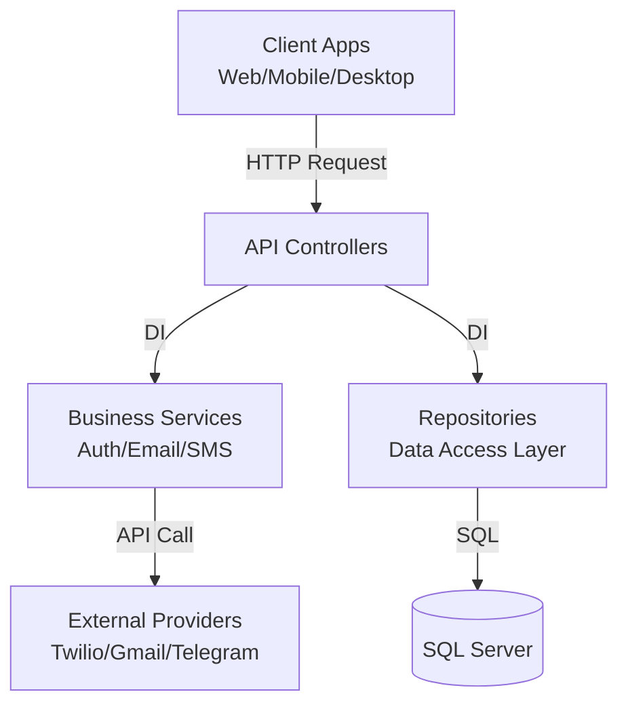

# 🎮 Games Tito API (Backend)

> **Backend Engine** para plataforma de distribuição e catálogo de jogos digitais.

## 📄 Sobre o Projeto

Este projeto é uma API RESTful desenvolvida em **.NET 9**, projetada para suportar um ecossistema multiplataforma (Web, Desktop e Mobile). O foco principal é oferecer uma base sólida, performática e segura para operações de comércio eletrônico de jogos.
### 🎯 Diferenciais Técnicos

* **Performance First:** Utilização de **ADO.NET puro** para manipulação de dados, garantindo máxima performance e controle sobre as queries SQL, ideal para cenários de alto volume de acessos.
* **Omnichannel Security:** Sistema robusto de recuperação de contas e notificações integrando múltiplos canais: **E-mail (SMTP), SMS, WhatsApp (Twilio) e Telegram Bot**.
* **Arquitetura Limpa:** Separação estrita de responsabilidades utilizando o padrão **Repository Pattern** e Injeção de Dependência.

---

## 🚀 Stack Tecnológica

* **Runtime:** [.NET 9](https://dotnet.microsoft.com/) (Latest Release)
* **Linguagem:** C# 13
* **Banco de Dados:** Microsoft SQL Server
* **Acesso a Dados:** `Microsoft.Data.SqlClient` (ADO.NET)
* **Segurança:** * Hash Híbrido (SHA256 + BCrypt)
* Proteção contra ataques de Força Bruta


* **Integrações:**
* 📧 **MailKit:** Envio de e-mails transacionais.
* 📱 **Twilio API:** Envio de SMS e WhatsApp.
* 🤖 **Telegram Bot API:** Notificações instantâneas via bot.


* **Documentação:** Swagger UI (OpenAPI).

---

## 🛠️ Funcionalidades Principais

### 🔐 Autenticação & Identidade (Account)

* [x] **Cadastro de Usuário:** Registro com validação de dados e hashing seguro de senha.
* [x] **Login:** Autenticação segura.
* [x] **Recuperação de Senha Omnichannel:**
* Envio de Token via **E-mail**.
* Envio de Token via **SMS**.
* Envio de Token via **WhatsApp**.
* Envio de Token via **Telegram**.


* [x] **Redefinição Segura:** Validação de token com expiração (15 minutos).

### 🛒 Catálogo & Vendas (Em Desenvolvimento)

* [ ] Listagem de Jogos (Vitrine).
* [ ] Detalhes do Produto.
* [ ] Carrinho de Compras.
* [ ] Processamento de Pedidos.

---

## ⚙️ Arquitetura

O projeto segue uma arquitetura em camadas para garantir manutenibilidade e escalabilidade:



---

## 🔧 Configuração e Execução

### Pré-requisitos

* [.NET 9 SDK](https://dotnet.microsoft.com/download)
* SQL Server (Express ou Docker)
* Visual Studio 2022 ou VS Code

### 1. Clonar o Repositório

```bash
git clone https://github.com/Eduxplorer/BackEndGamesTito.API.git
cd BackEndGamesTito.API

```

### 2. Configuração de Banco de Dados

Execute o script abaixo no seu SQL Server para criar a tabela necessária:

```sql
CREATE TABLE dbo.Usuarios (
    UsuarioId INT IDENTITY(1,1) PRIMARY KEY,
    NomeCompleto VARCHAR(150) NOT NULL,
    Email VARCHAR(150) NOT NULL UNIQUE,
    Telefone VARCHAR(20) NULL,
    TelegramChatId VARCHAR(50) NULL,
    PasswordHash VARCHAR(60) NOT NULL, -- Tamanho exato para BCrypt
    ResetToken VARCHAR(100) NULL,
    ResetTokenExpiry DATETIME2 NULL,
    DataCriacao DATETIME2 DEFAULT SYSUTCDATETIME(),
    StatusId INT DEFAULT 1
);

```

### 3. Configuração de Segredos (User Secrets)

⚠️ **Importante:** Este projeto não utiliza chaves hardcoded. Configure os segredos locais:

```bash
dotnet user-secrets init
dotnet user-secrets set "EmailSettings:SenderEmail" "seu-email@gmail.com"
dotnet user-secrets set "EmailSettings:Password" "sua-senha-de-app"
dotnet user-secrets set "SmsSettings:AccountSid" "seu-sid-twilio"
dotnet user-secrets set "SmsSettings:AuthToken" "seu-token-twilio"
dotnet user-secrets set "TelegramSettings:BotToken" "seu-token-botfather"

```

### 4. Executar

```bash
dotnet run

```

Acesse a documentação Swagger em: `https://localhost:7079/swagger`

---

## 🛡️ Segurança

A segurança das senhas utiliza uma abordagem de defesa em profundidade:

1. **Input:** A senha recebe um pré-processamento.
2. **Pepper:** Aplicação de uma chave secreta da aplicação.
3. **Hashing:** Utilização do algoritmo **BCrypt** (padrão de mercado) para armazenamento final, garantindo proteção contra *Rainbow Tables* através de *Salting* automático.

---

## 📬 Contato

**Eduardo** *Desenvolvedor Full Stack .NET* [LinkedIn](https://www.linkedin.com/in/eduardosantosdev/) | [GitHub](https://github.com/Eduxplorer)

---
